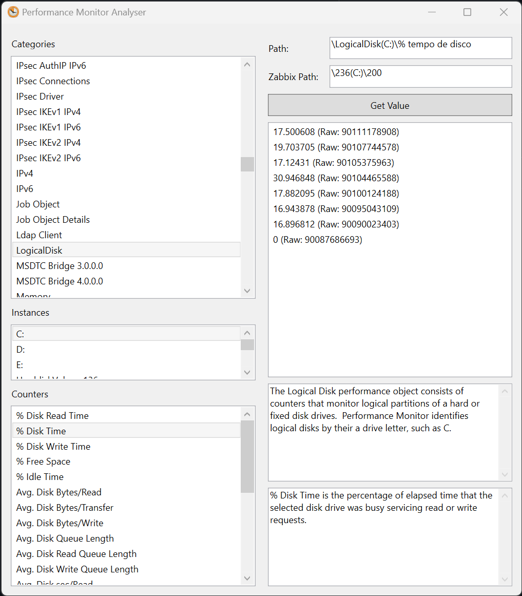

# Performance Monitor Analyser

Explorer for Microsoft Windows NT Performance Monitor. Provides counter path (Zabbix friendly), description and allows to get instant value.

## Installation

Don't need installation, just run it.

## Contributing

We are always open to contributions from developers and users. If you have suggestions, bug reports, or want to contribute code, please file an issue or pull request on our GitHub repository.

## Licença
This software is distributed under GNU GPL v3 license. For more information, read [LICENSE](./LICENSE) file.
